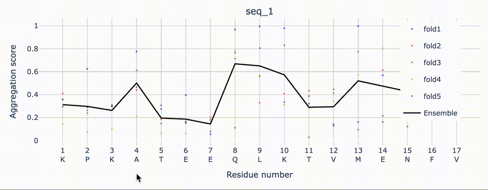

# PALM 🌴 - predicting peptide aggregation with language model embeddings

PALM is a deep learning model for predicting amyloidogenic regions in protein sequences at residue-level resolution. It combines the protein language model, ESM2 8M, with an adapted light attention architecture to achieve state-of-the-art performance in aggregation prediction.

## Features

- **Residue-level predictions** for amyloidogenic propensity
- **Multiple model variants**: `PALM`, `PALM_NNK`, `PALM_NNK_OH` (model weights available via `PALM_models` directory)
- **Ensemble predictions** across 5-fold cross-validation models
- **Flexible inference** supporting CSV, FASTA, or direct sequence input
- **Hydra-configurable training code** for model exploration

## Installation
```bash
# Clone the repository
git clone https://github.com/your-org/PALM.git
cd PALM

# Create conda environment
conda create -n palm python=3.10
conda activate palm

# Install poetry for dependency management through [1] pipx or [2] curl 
1. pipx install poetry
2. curl -sSL https://install.python-poetry.org | python3 -


# Install all dependencies via poetry
poetry install

#export PYTHONPATH
export PYTHONPATH='location of the repo':$PYTHONPATH
```

## Inference

### 1. Sequences

```bash
# Direct sequence input
python src/cli/inference.py \
    --sequences MVLSEGEWQLVLHVWAK KPKATEEQLKTVMENFV \
    --model_name PALM_NNK

# From FASTA file
python src/cli/inference.py --fasta proteins.fasta --model_name PALM
```

### 2. CSV file

Run inference on csv file:

```bash
python src/cli/inference.py --csv 'path to csv file' --model_name PALM
```


## Model Training

### Configuration Management with Hydra

PALM uses [Hydra](https://hydra.cc/) for configuration management, enabling flexible experiment configuration through command-line overrides without modifying code files.

### Training Example

Train a PALM model with ESM2 embeddings and LightAttention predictor:

```bash
TORCH_USE_CUDA_DSA=1 CUDA_LAUNCH_BLOCKING=1 python src/cli/training.py \
    mlflow=local \
    persistence=local \
    persistence.training_data=fibrillation_data \
    dataset.use_predefined_split=true \
    dataset.data_split_column=data_split_fold1 \
    dataset.data_name='' \
    dataset.task=classification_binary \
    persistence.artifacts_root_folder=/path/to/artifacts \
    embedder=esm2_t6_8M \
    embedder.mean_pool=false \
    dimred=noreduction \
    predictor=lightattention \
    predictor.hparams.kernel_size=5 \
    predictor.hparams.max_epochs=10 \
    predictor.hparams.patience=200 \
    predictor.hparams.batch_size=1000 \
    predictor.hparams.learning_rate=0.05 \
    mlflow.experiment_name=ML-BP-Domino \
    plots.generate_plots=false
```

### Key Training Parameters

- **embedder**: ESM2 model variant (`esm2_t6_8M`, `esm2_t12_35M`, etc.)
- **predictor**: Model architecture (`lightattention`, `cnn`, `lstm`)
- **dataset.data_split_column**: Fold assignments for cross-validation (`data_split_fold1` to `data_split_fold5`)
- **predictor.hparams**: Hyperparameters for the predictor model

## Pretrained Models

Models are available within the repository at PALM_models/ directory

### Model Variants

1. **PALM**: Base model with ESM2 embeddings
2. **PALM_NNK**: Enhanced with CANYA features
3. **PALM_NNK_OH**: NNK with one-hot encoding

Each variant includes 5 cross-validation folds for ensemble predictions.

## Usage Examples

### Basic Inference with Flexible Input

```bash
# From FASTA file with ensemble predictions
python src/cli/inference.py --fasta proteins.fasta --model_name PALM

# From CSV file (must have 'sequence' column)
python src/cli/inference.py --csv sequences.csv --output_prefix results

# Direct sequence input
python src/cli/inference.py \
    --sequences "MVLSEGEWQLVLHVWAK" "KPKATEEQLKTVMENFV" \
    --model_name PALM

#Direct plot outputs a html file of aggregation profile plot  of residues within a sequences using the plot command 
python inference_script.py --fasta sequences.fasta --plot

# Disable ensemble (use individual folds only)
python src/cli/inference.py --fasta proteins.fasta --no_ensemble


# Specify custom model directory
python src/cli/inference.py \
    --fasta proteins.fasta \
    --models_dir /path/to/PALM_models \
    --model_name PALM
```


### Force CPU Usage

```bash
# For flexible inference
python src/cli/inference.py --fasta proteins.fasta --cpu
```
## Output Format

The inference script generates comprehensive predictions at both sequence and residue levels in two separate files:

## Output Format

The inference script generates comprehensive predictions at both sequence and residue levels in two separate files:

### 1. Sequence-level predictions (CSV)

**File:** `{output_prefix}_sequences.csv`

- **name**: Sequence identifier
- **sequence**: Original protein sequence
- **{model}_fold[1-5]_seq_score**: Sequence-level predictions for each fold
- **{model}_ensemble_seq_score**: Ensemble sequence prediction (mean of all folds)

Example:
```bash 
name,sequence,PALM_fold1_seq_score,PALM_fold2_seq_score,PALM_fold3_seq_score,PALM_fold4_seq_score,PALM_fold5_seq_score,PALM_ensemble_seq_score
Protein_1,MVLSEGEWQL...,0.734,0.742,0.728,0.751,0.739,0.739
Protein_2,LIVTQTMKGL...,0.423,0.431,0.418,0.427,0.435,0.427
```

### 2. Residue-level predictions (JSON)
```bash
File: {output_prefix}_residues.json
json{
  "Protein_1": {
    "sequence": "MVLSEGEWQL...",
    "length": 150,
    "PALM_fold1_residue_scores": [0.23, 0.45, 0.67, ...],
    "PALM_fold2_residue_scores": [0.21, 0.43, 0.65, ...],
    "PALM_ensemble_residue_scores": [0.22, 0.44, 0.66, ...],
    "summary": {
      "mean_residue_score": 0.45,
      "max_residue_score": 0.95,
      "min_residue_score": 0.05,
      "high_risk_positions": [25, 67, 89]
    }
  }
}
```
### Prediction Values

Probability scores (0-1): Higher values indicate greater amyloidogenic propensity
Residue arrays: Each position corresponds to aggregation probability for that residue
High-risk positions: Residue positions with scores > 0.5

The `--plot` argument can be used to generate residue score plots with plotly



## Project Structure
```bash
PALM/
├── src/
│   ├── cli/
│   │   ├── training.py          # Training script
│   │   ├── inference.py         # Inference script
│   │   └── sequence_inference.py # Direct sequence inference
│   ├── model/
│   │   ├── composite_model.py   # Main model class
│   │   ├── embedders.py         # ESM2 embeddings
│   │   └── predictors.py        # LightAttention, CNN, LSTM
│   └── helpers/
│       ├── dataset.py           # Data loading utilities
│       └── pytorch/
│           └── light_attention.py # LightAttention implementation
├── configs/                      # Hydra configuration files
├── datasets/                     # Training/test datasets
└── PALM_models/                  # Pretrained models directory
```


## Citation

If you use PALM in your research, please cite:

```bibtex
@article {Eschbach2025.09.26.678773,
	author = {Eschbach, Ethan and Deibler, Kristine and Korani, Deepa and Swanson, Sebastian Robles},
	title = {Predicting peptide aggregation with protein language model embeddings},
	elocation-id = {2025.09.26.678773},
	year = {2025},
	doi = {10.1101/2025.09.26.678773},
	publisher = {Cold Spring Harbor Laboratory}
    URL = {https://www.biorxiv.org/content/early/2025/09/29/2025.09.26.678773},
	eprint = {https://www.biorxiv.org/content/early/2025/09/29/2025.09.26.678773.full.pdf},
	journal = {bioRxiv}
```

## Requirements

- Python 3.10+
- Torch 2.3.0
- CUDA 11.8+ (for GPU support)
- ESM2 models from Facebook Research
- See `pyproject.toml` for complete list

## Troubleshooting

### CUDA/CPU device mismatch
Use the `--cpu` flag to force CPU usage:
```bash
python src/cli/inference.py --dataset data.csv --cpu 
```

### Memory issues with large datasets
Reduce batch size in training or use smaller ESM2 variants.

## License

MIT License - see LICENSE file for details

## Contact

For questions and support, please open an issue on GitHub
